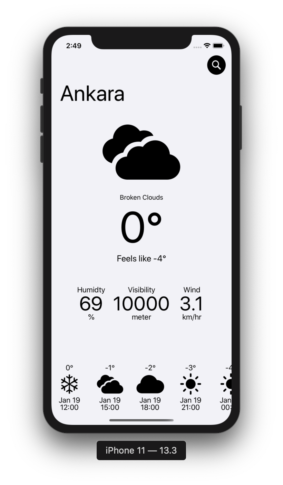
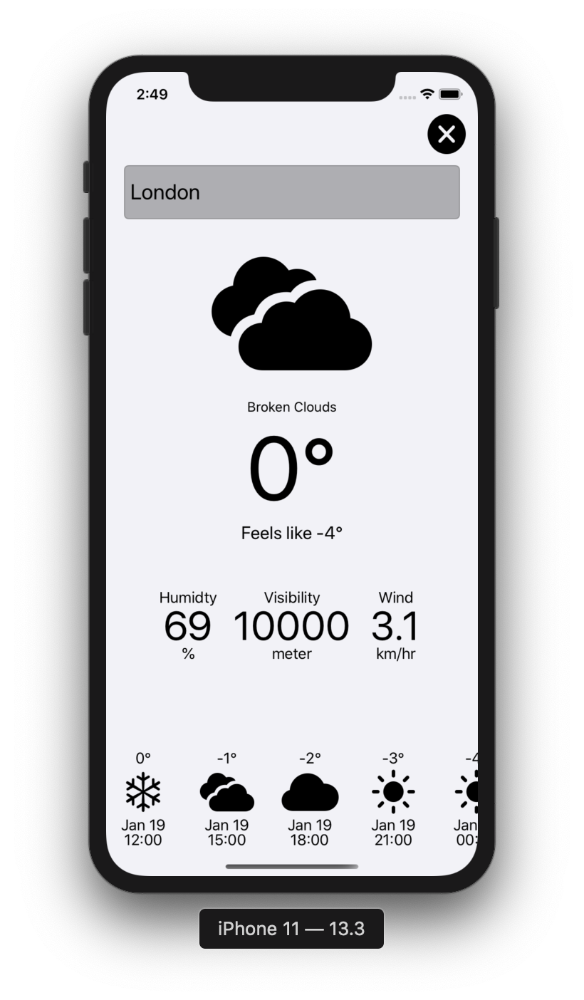
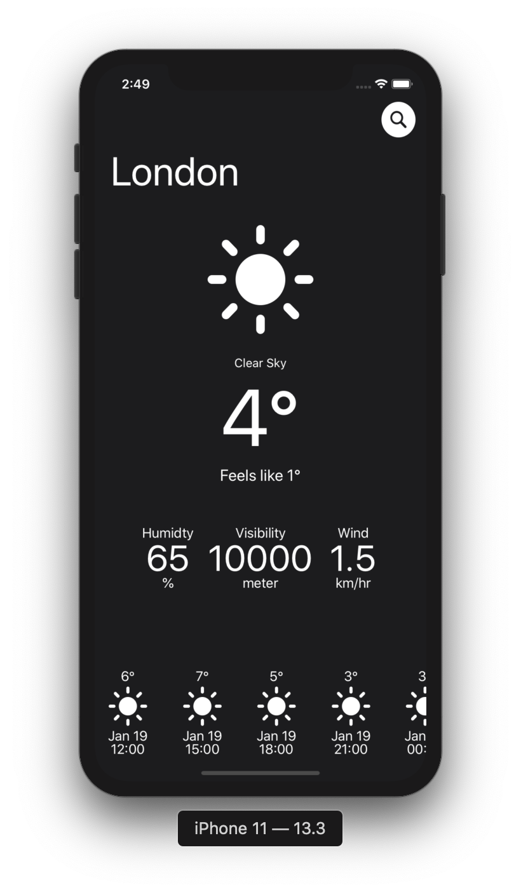
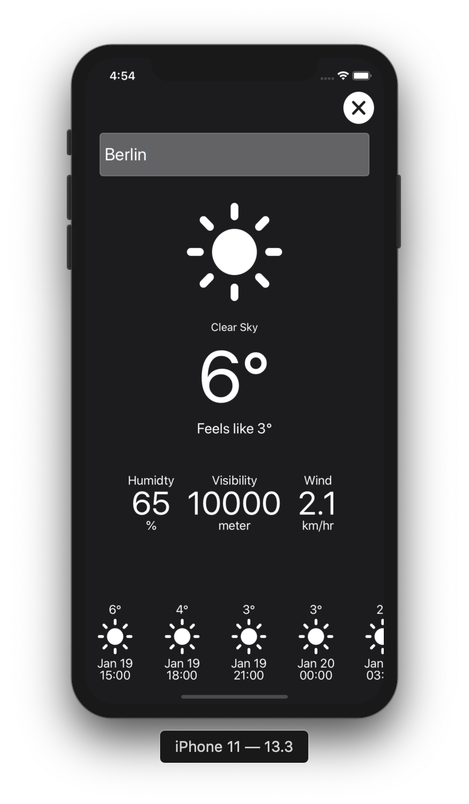

# PerfectWeatherApp

The API of [https://openweathermap.org/](https://openweathermap.org/api) was used.
In the application you can see current and daily weather information.

## Screenshots

### LightMode

### DarkMode

